<p align="center">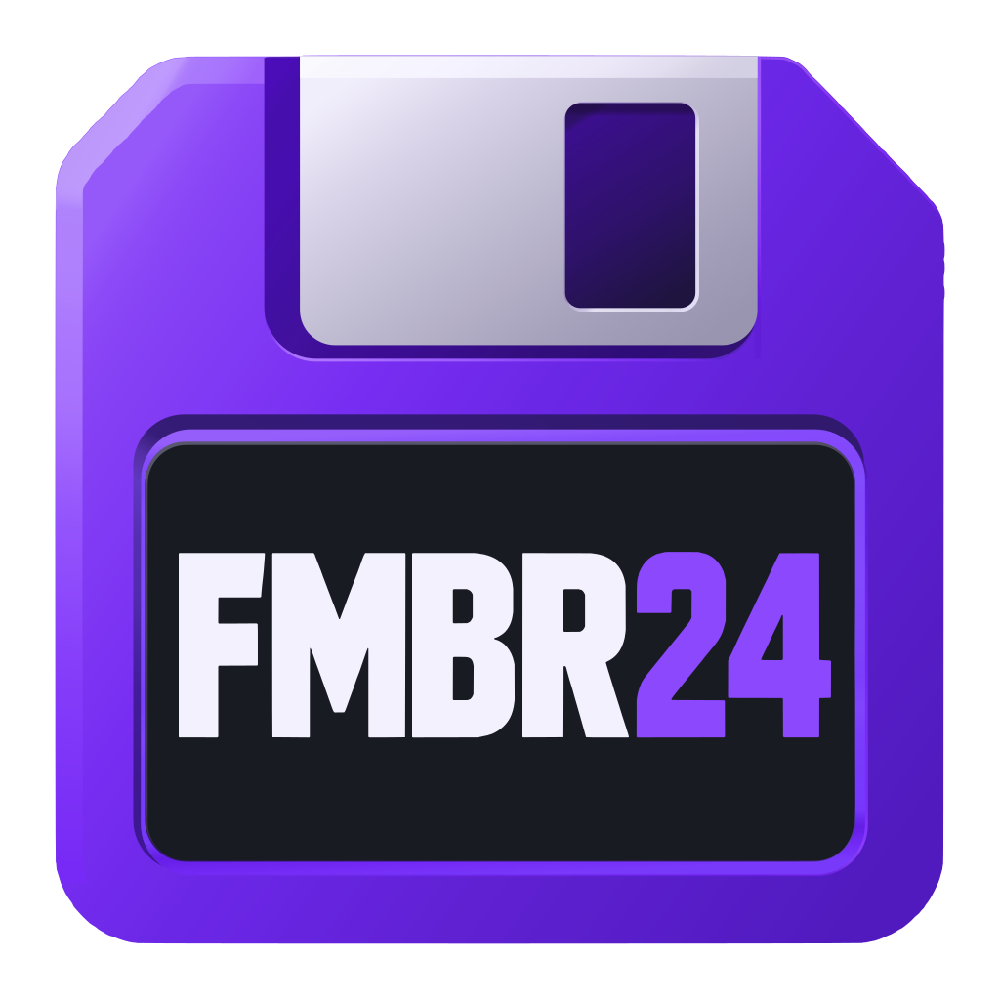</p>

<h1 align="center">FM Backroom 24 (FMBR24)</h1>

<p align="center">Scout, browse and lightly edit your Football Manager 2024 saves on Linux, in a desktop app that looks the part.</p>

<p align="center">
  
  
  
  
  
</p>

<p align="center"><a href="docs/screenshots/player-profile.png">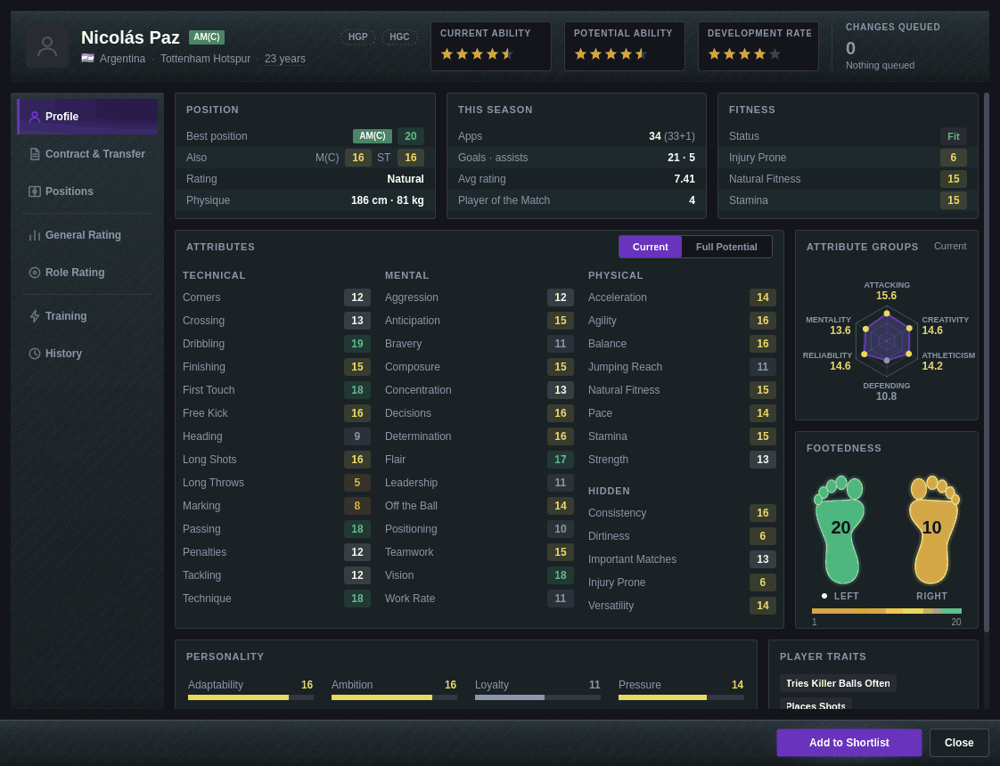</a></p>

## Why this exists

There are very few scouting and editing tools for Football Manager on Linux. FMBR24 aims to be a Swiss-army knife for FM24 on Linux: scouting, save viewing and a little editing, with a UI that is a pleasure to use rather than a pile of spreadsheets.

You open a save, and the app reads it directly. No game running, no paid tool, no need to know a player's name in advance: look first, then decide.

## Features

**Scouting and reports**
- Players and Staff tables covering every person in the database (about 78,000 players and 50,000 staff in a typical save), with quick filters (name, position, CA, PA, age, development rate)
- Player Reports: Best Prospects, Wonderkids, Best in Position, Best by Role (role weight presets, editable and importable in Settings)
- Player and Staff Shortlists

**Squad and club**
- Save Info: game name and dates, game version, database version, manager and club, nations and leagues
- Club page: squad KPIs, top players by average rating, contract expiries, injuries, reputation, stadium, league position, finances, scouting budget
- Squads with full attributes, contracts and injuries (first team, U21, U18) and a Club Staff list

**Player window**
- Profile: attributes by group, an attribute radar, footedness, personality, traits, season stats and fitness
- Role ratings as a percentage per position, with a pitch view
- Value-by-age trend chart (an estimate anchored on the stored market value, not a price)
- Positions: a rating for every position, shown as a list and on a pitch
- Contract & Transfer: contract dates and wage, market value
- Career history, recommended traits, and a Current / Full Potential projection (display only)
- CA, PA and Development Rate as stars or raw numbers (Settings)

**Editing**
- Homegrown flags (HGP / HGC) for the players of your own club: queue them from the player window or the Squads toolbar, then press Save Changes
- Save writes a verified temp file, keeps two rolling backups (`.bk1`, `.bk2`), replaces the save atomically and reloads it

**Quality of life**
- Search box with autocomplete for clubs, players and staff, Back / Forward history
- After a Save or Reload you land back on the same page, filters, sort and selection
- A parse cache makes loading the same save again quick
- Player window texture themes, landing page and other options in Settings

## Screenshots

Click a picture for the full size. They are generated from a real save with `scripts/make_screenshots.py`.

<table>
  <tr>
    <td width="50%"><a href="docs/screenshots/save-info.png">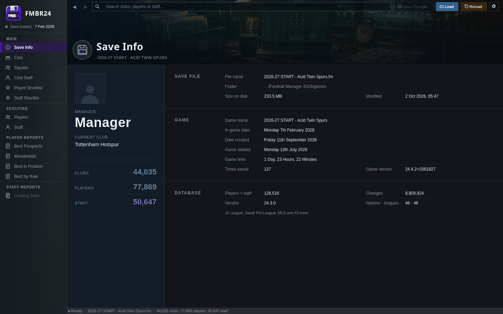</a><br><sub>Save Info</sub></td>
    <td width="50%"><a href="docs/screenshots/club.png">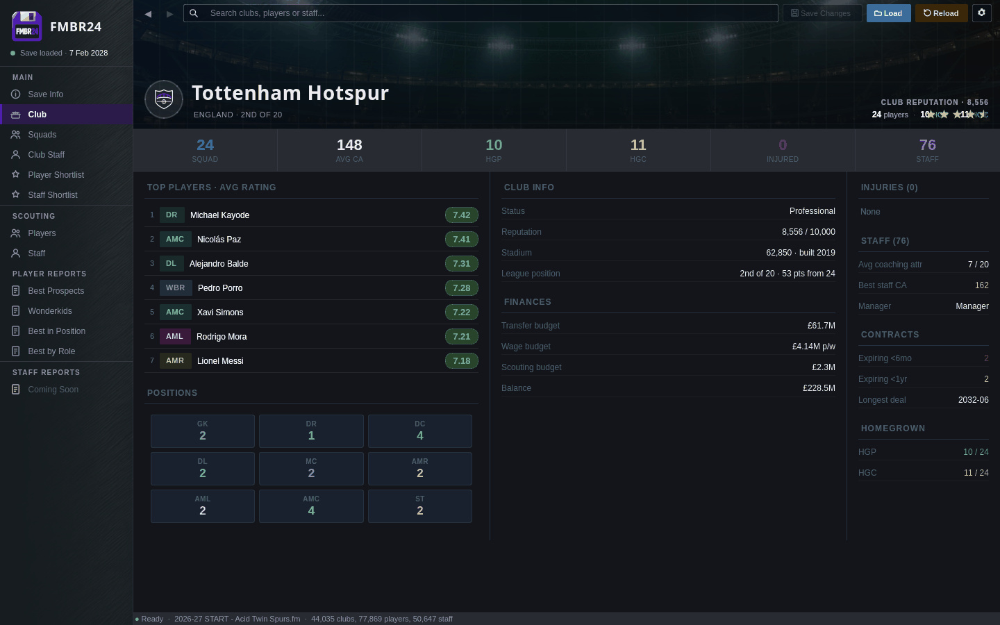</a><br><sub>Club</sub></td>
  </tr>
  <tr>
    <td><a href="docs/screenshots/squads.png">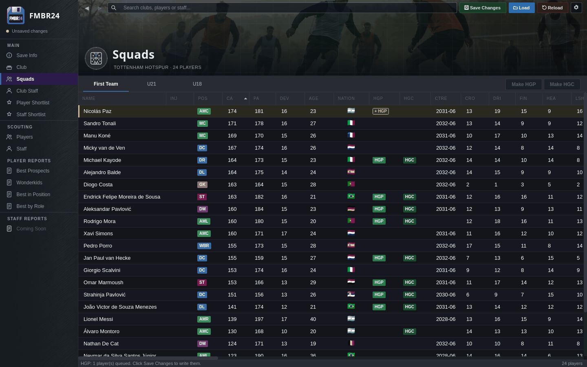</a><br><sub>Squads, with HGP / HGC badges and one queued change (yellow)</sub></td>
    <td><a href="docs/screenshots/scouting-players.png">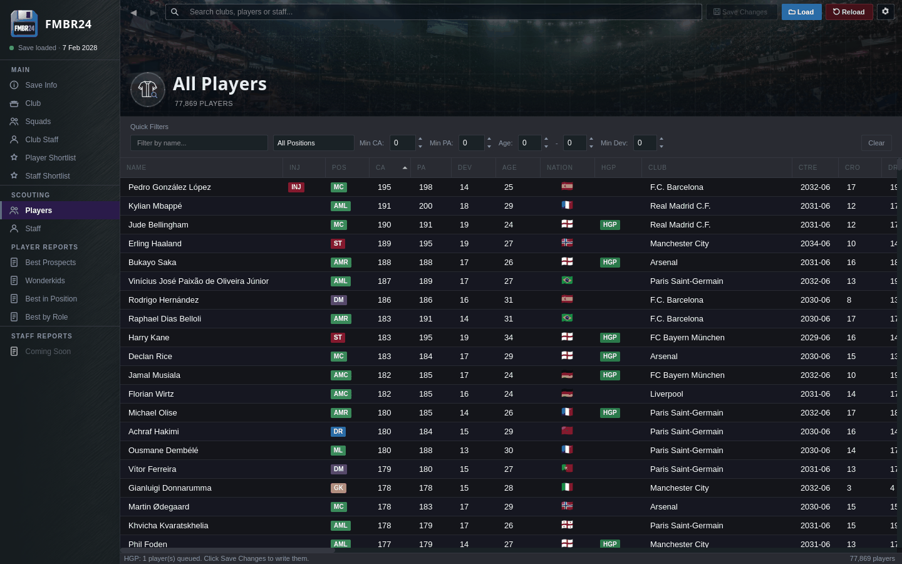</a><br><sub>Scouting: all players</sub></td>
  </tr>
  <tr>
    <td><a href="docs/screenshots/player-report.png">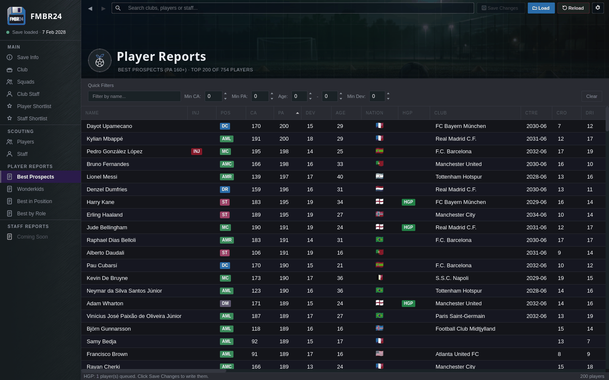</a><br><sub>Player report: Best Prospects</sub></td>
    <td><a href="docs/screenshots/settings.png">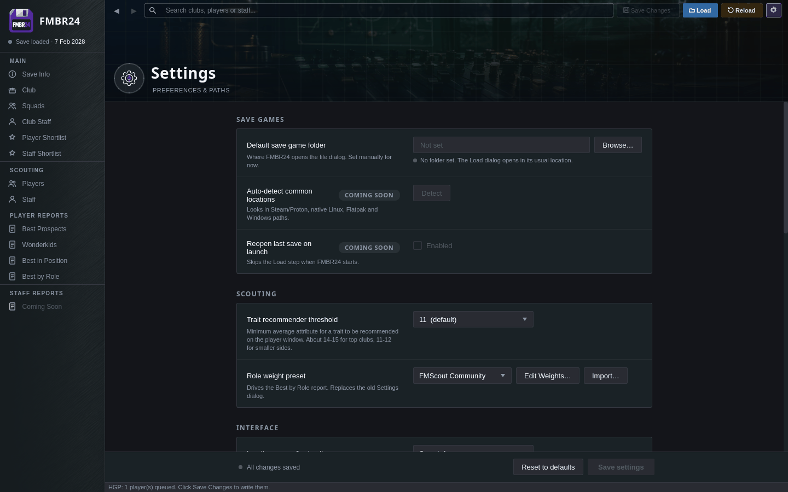</a><br><sub>Settings</sub></td>
  </tr>
  <tr>
    <td><a href="docs/screenshots/player-profile.png"></a><br><sub>Player window: Profile (radar, footedness, attributes)</sub></td>
    <td><a href="docs/screenshots/player-contract.png">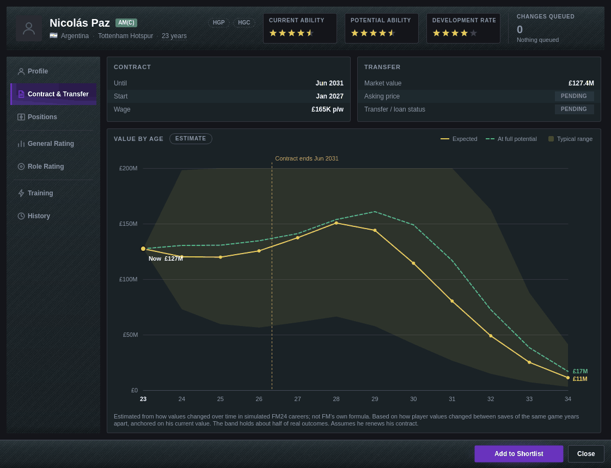</a><br><sub>Player window: Contract &amp; Transfer (value by age)</sub></td>
  </tr>
  <tr>
    <td><a href="docs/screenshots/player-positions.png">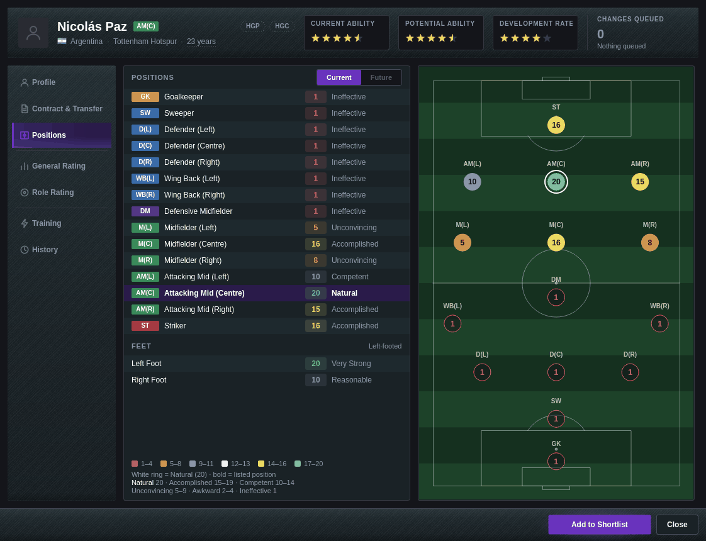</a><br><sub>Player window: Positions</sub></td>
    <td><a href="docs/screenshots/player-role-rating.png">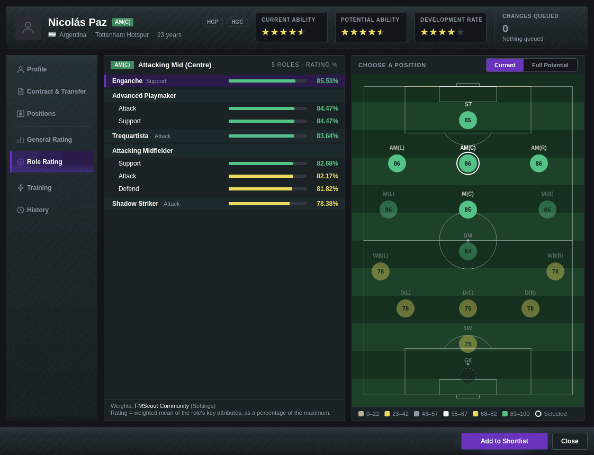</a><br><sub>Player window: Role Rating</sub></td>
  </tr>
</table>

## Status and roadmap

FMBR24 is **alpha** and supports **FM24 saves only**. It is built and tested on Linux first.

- Transfer data (asking price, transfer-listed and loan-listed status) is still being reverse-engineered, so those fields show as PENDING
- A General Rating tab is planned for the player window
- The staff window is due a redesign
- At 1.0: a Flatpak package and a Windows `.exe`

## Feature requests and bugs welcome

This is a young project and feedback shapes it. [Open an issue](https://github.com/acidtwin/FMBR24/issues/new/choose) for a bug report or a feature request.

For a bug, please include:
- what you did and what you expected to happen
- your FM24 game version (shown on the Save Info page) and the size of the save
- the crash log, `/tmp/fm_editor_debug.log`, if the app crashed or showed an error

Please do not attach your save to a public issue unless you are happy for anyone to download it. It holds your whole game database.

## Run

```bash
pip install -r requirements.txt   # PyQt6, zstandard, numpy
python main.py
```

Python 3.12 on Linux. Click Load and pick your FM24 save (`.fm`). Saves made by Football Manager 2024 under Steam and Proton are the tested case.

## Test

The tests are plain scripts, no pytest. Use a temporary config directory so your real settings stay untouched:

```bash
FMBR24_CONFIG_DIR=$(mktemp -d) QT_QPA_PLATFORM=offscreen python3 tests/test_<name>.py
```

Tests that need a real save skip themselves when it is not found. To rebuild the screenshots above:

```bash
python3 scripts/make_screenshots.py /path/to/your/save.fm
```

## Safety

FMBR24 reads your save and, only when you press Save Changes, writes the homegrown flags you queued. To keep that safe:

- It only edits homegrown flags, and only for the players of your own club
- Every save is written to a temp file and checked before it replaces anything
- It keeps two rolling backups next to your save (`.bk1`, the file before the last save, and `.bk2`, the one before that). Nothing is overwritten without them
- It refuses to save if the file changed on disk since you loaded it
- Loading a save that was edited with an HGC insert in FM24 itself is not yet verified in game

Keep your own backups too. This is alpha software and FM saves are big, binary and undocumented.

## Inspired by

- **FMRTE.** I tried to buy the FM24 version for about a month, but the site kept looping or failing and support did not reply. So I decided to build my own. It is a well-known tool and I am sure it works fine for many people
- **FM Genie Scout / FM Scout.** A huge inspiration, especially its transfer and role-rating style screens
- <!-- [TODO: name of the Linux FM editor project] --> An earlier Linux FM save-editing project showed it was possible, which is why I started

Unofficial fan tool for Football Manager 24 — not affiliated with or endorsed by Sports Interactive or SEGA. Football Manager and FM are trademarks of their respective owners.
